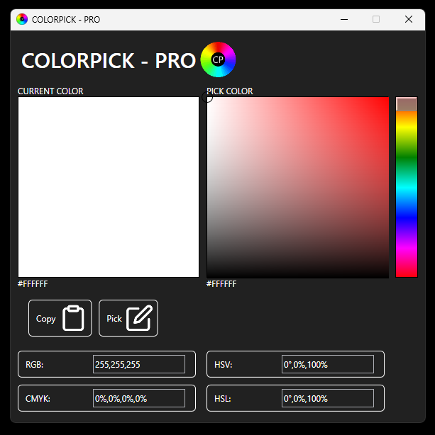

#  Colorpick - PRO

# Description
Colorpick - PRO is a lightweight and simple color picker for Windows.  
It allows you to pick any color and view it in multiple formats such as RGB, CMYK, HSV, HSL, and HEX.

# Usage
Download and launch the executable `ColorpickPRO.exe`.  
The program is portable and does not require installation.

[Releases](https://github.com/YourUserName/ColorpickPRO/releases)

# Features
- Pick any color using a visual selector
- Copy HEX values instantly
- View color in multiple formats:
  - RGB
  - CMYK
  - HSV
  - HSL
  - HEX
- Lightweight and portable

# Requirements
- Windows (7 and up)
- .NET Framework Installed

# Contribute
You can contribute by:
- Submitting bug reports or feature requests in the [Issues](../../issues) section.
- Creating pull requests with improvements or new features.

# Screenshots

# Thank you for using Colorpick - PRO
If you enjoy this software, consider supporting its development:  

